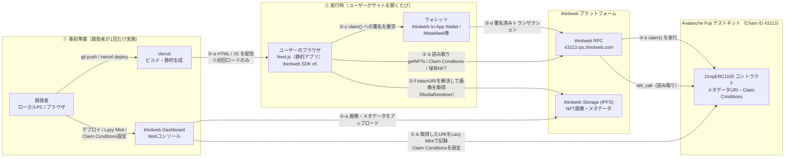

# Avalanche Fuji NFT Drop Studio

Web3フレームワーク [thirdweb](https://thirdweb.com/) を用いた、Avalanche Fujiテストネット向けのNFT発行（Minting）サイトです。thirdwebの NFT Collection（`DropERC1155` + Lazy Mint + Claim Conditions）を使い、ユーザーが自分のウォレットを接続してNFTをclaim（mint）できる公開サイトとして構成しています。

> **コントラクト方式についての補足**: 開発当初はthirdwebブログの`nft-drop`タグに合わせて`DropERC721`を想定していましたが、実際にthirdweb Dashboardから「NFT Collection」テンプレートでデプロイしたところ、内部的には`DropERC1155`（Edition Drop）としてデプロイされることが判明しました（thirdweb側でUI・テンプレート統合が行われたため）。`DropERC1155`は1つのトークンIDに対して複数枚（Supply）を発行できる方式で、フロントエンドは1トークンID＝1コンテンツとして扱うことで、当初想定していた「限定コレクティブル配布」のコンセプトを維持しています。複数のユニークなコンテンツを追加したい場合は、Lazy Mintで別のトークンIDを追加するだけで、サイトのギャラリーに自動的に並びます（コード変更不要）。

コントラクトのデプロイやClaim Conditionsの設定は [thirdweb Dashboard](https://thirdweb.com/login?next=%2Fteam%3Fref%3Dblog.thirdweb.com) で行います（要ログイン／要ウォレット接続）。使い方は「5.3 thirdweb Dashboardでの準備」で詳しく説明します。

> **名称・フォルダ名について**: 開発初期はEthereum Sepoliaを使う想定でプロジェクトを作成したため、ローカルのフォルダ名は`sepolia-nft-drop-studio`のままです（作業環境の制約でフォルダ名の変更ができませんでした）。中身は現在Avalanche Fuji向けに変更済みで、`package.json`の`name`は`avalanche-fuji-nft-drop-studio`に更新しています。GitHubにpushする際は、6章の手順に従って`avalanche-fuji-nft-drop-studio`等の実態に合ったリポジトリ名を付けることを推奨します。ローカルのフォルダ名も、提出前にお好みで変更して構いません。

---

## 1. 作ったものの説明

### 用途

自分で用意したユニークなデジタルコンテンツ（画像等）を、**数量限定・条件付き**で配布するためのサイトです。トークンID（コンテンツ）ごとに個別のClaim Conditionsを設定できるため、「全員同じ画像を無制限配布」ではなく、限定コレクティブルの配布という用途に対応します。

- **数量限定**: Claim Conditionsの `maxClaimableSupply` で総発行数の上限を設定する。上限に達するとそれ以上claimできない。
- **条件付き配布**: Claim Conditionsのallowlist機能を使い、特定のウォレットアドレスのみがclaimできるように制限できる。配布開始日時・終了日時、1ウォレットあたりの上限枚数も設定可能。
- **コンテンツ単位の管理**: Lazy MintでトークンIDごとに異なる画像・メタデータを登録する。ユーザーはギャラリーから欲しいトークンIDを選んでclaimし、同一トークンIDに対してはSupplyの範囲内で同じコンテンツが発行される（ERC-1155方式）。トークンIDごとに個別のClaim Conditionsを設定できるため、コンテンツ単位で配布条件を変えられる。

> **補足**: `DropERC721`（ERC721A Drop）はclaimされた順に別々のトークンIDが自動で割り当てられる方式だが、本プロジェクトが実際にデプロイしたのは `DropERC1155` であり、**claim順にコンテンツが変わるわけではない**（ユーザーがトークンIDを選ぶ）。この違いは構成上の重要な差なので混同しないこと。

### 動作の流れ

- ユーザーはブラウザでサイトにアクセスし、MetaMask等のウォレットを接続する。
- サイトはthirdweb Dashboardで事前にデプロイ済みの `DropERC1155` コントラクト（Avalanche Fuji上）に対して、Lazy Mintされている全トークンを取得し、それぞれの現在のClaim Conditions（価格・残り供給数・期間等）を読み取ってギャラリー形式で表示する。
- ユーザーが「Mint（Claim）する」ボタンを押すと、ウォレットで `claim()` トランザクションへの署名を求められ、承認するとAvalanche Fuji上でNFTが発行され、ユーザーのウォレットに送られる。
- NFTの画像・メタデータは、thirdweb Dashboardでの事前アップロード時にthirdweb Storage（IPFS）へ保存されており、サイト自体はその参照のみを扱う。
- フロントエンド（Next.js）はサーバーサイドで秘密鍵や機密情報を一切扱わない。取引の署名は常にユーザーのウォレット内で完結する（非カストディアル）。

### 使わなかった構成とその理由

- **独自バックエンドAPI / DB**: 発行状態・供給数・価格はすべてオンチェーン（コントラクト）で管理されるため、二次的なバックエンドを持つ理由がない。追加すると同期不整合や攻撃対象領域が増えるだけなので採用しなかった。
- **Docker Compose / Kubernetes によるプライベートクラウド構成**: 本構成はサーバーサイドで機密情報を扱わない静的〜SSRのフロントのみであり、「プライベートクラウド前提」の条件に該当しないと判断したため、Vercel（パブリッククラウド無料枠）を採用した。バックエンドを追加する要件が生じた場合はOracle Cloud Free Tier上でDocker Composeを使う構成に切り替える。
- **Ethereum Sepolia**: 開発初期の候補だったが、Ethereum FoundationがSepoliaのEOL（運用終了）を2026年9月30日頃と発表しており、後継テストネットへの移行が計画されている。Base Sepolia / Arbitrum Sepolia / Optimism SepoliaといったL2テストネットはSepoliaをL1決済層として使うため同じ影響を受け、Polygon AmoyもSepoliaをroot chainとするチェックポイント構造で間接的に影響を受ける。これらに対し、Avalanche FujiはEthereumのアップグレードロードマップから独立したAvalanche独自のL1テストネットであり、この種の連鎖的な移行リスクがない。詳細は9章参照。

---

## 2. システム構成図



**この構成図の要点**

- **Vercelは実行時のデータ経路に入らない**。`app/page.tsx` は `"use client"` で、ビルド結果も `○ (Static) prerendered as static content` となる完全な静的プリレンダリングであり、Vercelは初回ロード時にHTML/JSを配信するだけ。以降のRPC呼び出し・署名・画像取得はすべてブラウザが直接行う。したがってサーバー側に秘密鍵は一切存在しない。
- **スマートコントラクトはIPFSを参照しない**。コントラクトが保持するのは `tokenURI` の文字列のみで、実際にIPFSから画像を取得するのはブラウザ側の `MediaRenderer`。
- **事前準備と実行時は別の時間軸**。thirdweb Dashboardはコントラクトのデプロイ・Lazy Mint・Claim Conditions設定を行う管理ツールであり、ユーザーのmint操作時には介在しない。

GitHub上ではMermaidブロックはそのまま図として描画されます。画像ファイルとして提出したい場合は、GitHub上でこのREADMEを開きスクリーンショットを撮るか、`docs/architecture.mmd` を [Mermaid Live Editor](https://mermaid.live/) に貼り付けてPNG/SVGを書き出してください。

---

## 3. 使用したクラウドサービス・ソフトウェア一覧

| 分類 | 名称 | 役割 | 料金プラン |
|---|---|---|---|
| ホスティング | Vercel | Next.jsアプリのビルド・静的アセット配信 | Hobby（無料） |
| Web3フレームワーク | thirdweb SDK v5 (5.120.1) | ウォレット接続・コントラクト読み書きのReactコンポーネント/フック提供 | 無料枠 |
| Web3管理コンソール | thirdweb Dashboard | コントラクトのデプロイ、Lazy Mint、Claim Conditions設定 | 無料枠 |
| 分散ストレージ | thirdweb Storage (IPFS) | NFT画像・メタデータの保存 | 無料枠 |
| ブロックチェーン | Avalanche Fuji Testnet（Chain ID 43113） | NFT(DropERC1155)コントラクトの実行環境 | テストネット（無料） |
| フロントエンドフレームワーク | Next.js 16.2.11 (App Router) | UI実装、ビルドパイプライン | OSS |
| 言語 | TypeScript 6.0.3 | 型安全な実装（7系はNext.jsの内部型チェックが未対応のため見送り、下記10章参照） | OSS |
| UIライブラリ | React 19 | コンポーネント描画 | OSS |
| ウォレット | thirdweb In-App Wallet / MetaMask（ユーザー側） | トランザクション署名 | 無料 |
| バージョン管理 | GitHub | ソースコード公開・提出物のURL提示先 | 無料枠 |

---

## 4. ソースコードの確認先URL

```
https://github.com/FloatedGecko667/avalanche-fuji-nft-drop-studio
```

---

## 5. セットアップ手順（ローカル開発）

### 5.1 前提

- Node.js 20以上
- npm
- MetaMaskなどのブラウザウォレット拡張（詳細は5.2）
- thirdweb アカウント（[thirdweb Dashboard](https://thirdweb.com/login?next=%2Fteam%3Fref%3Dblog.thirdweb.com) で無料登録・ログイン。詳細は5.3）
- Avalanche Fuji testnet AVAX（faucetで取得。詳細は5.2）

### 5.2 ウォレット（MetaMask）の準備と使い方

このサイトは非カストディアル、つまり秘密鍵をサイト側が一切預からない構成です。すべての署名操作はブラウザのウォレット拡張機能の中で完結します。ここではMetaMaskを例に説明します。

#### 5.2.1 インストールとアカウント作成

1. [MetaMask公式サイト](https://metamask.io/download/) から、使用しているブラウザ用の拡張機能をインストールする。**必ず公式サイトからインストールすること**（検索結果の広告や偽サイトからのインストールは詐欺の可能性がある）。
2. 拡張機能を開き、「新しいウォレットを作成」を選ぶ。
3. パスワードを設定した後、**シークレットリカバリーフレーズ（12〜24単語のニーモニック）**が表示される。これはウォレットの復元に使う唯一の手段であり、**誰にも教えてはいけない**（thirdwebも、当サイトも、サポートを名乗る誰かも、これを尋ねることは絶対にない）。オフラインでメモし、スクリーンショットやクラウド保存は避ける。
4. 表示された単語を確認画面で正しい順番に並べ直し、ウォレット作成を完了する。

> テストネット専用のウォレットであっても、シークレットリカバリーフレーズの管理は本番と同じ慎重さで扱う習慣をつけてください。同じフレーズから生成される別チェーン上のアカウントに、意図せず資産を置いてしまうケースがあるためです。

#### 5.2.2 Avalanche Fujiネットワークの追加

MetaMaskにはAvalanche Fujiが標準搭載されていない場合があるため、手動で追加します。

1. MetaMask右上のネットワーク切り替えメニューを開き、「ネットワークを追加」を選ぶ。
2. 「ネットワークを手動で追加」から以下の値を入力する。

| 項目 | 値 |
|---|---|
| ネットワーク名 | Avalanche Fuji Testnet |
| Chain ID | `43113` |
| 通貨記号 | AVAX |
| RPC URL | `https://43113.rpc.thirdweb.com`（[Chainlist](https://chainlist.org/?search=fuji) からも追加可能） |
| ブロックエクスプローラー | [https://testnet.snowtrace.io](https://testnet.snowtrace.io/) |

このサイト自体を開いてConnectButtonからウォレット接続を行うと、thirdweb SDKがAvalanche Fujiへのネットワーク追加・切り替えを自動的に促すダイアログを出すため、その案内に従う方法でも追加できます。

#### 5.2.3 テストネットAVAXの入手（faucet）

Avalanche Fujiのガス代（テストAVAX）は無料のfaucetから入手します。MetaMaskに表示されているウォレットアドレス（`0x...`）をコピーし、以下のいずれかに貼り付けてリクエストする。

- [thirdweb Avalanche Fuji Faucet](https://thirdweb.com/avalanche-fuji)（0.01 AVAX/日）
- [Avalanche公式 Testnet Faucet（Core）](https://core.app/tools/testnet-faucet/?subnet=c&token=c)

反映まで数十秒〜数分かかることがあります。MetaMaskの残高表示か、[Snowtrace (testnet)](https://testnet.snowtrace.io/) にアドレスを貼り付けて確認してください。

#### 5.2.4 サイトへの接続とmint操作

1. サイトを開き、右上の「Connect」ボタン（`ConnectButton`）を押す。
2. ウォレット選択画面でMetaMaskを選ぶと、MetaMaskの拡張機能ポップアップが開き、接続許可を求められる。内容を確認し「接続」を承認する。
3. サイトが自動的にネットワークをAvalanche Fujiに切り替えるよう促す場合があるので、ポップアップの指示に従う。
4. 「Mint（Claim）する」ボタンを押すと、MetaMaskに取引内容（宛先コントラクト、概算ガス代）が表示されたポップアップが開く。内容を確認し「確認」を押すと署名・送信される。
5. トランザクションがAvalanche Fuji上で承認される（約2秒、Sepolia等より高速）と、mint成功のメッセージが表示される。

#### 5.2.5 発行されたNFTの確認方法

- **MetaMask内**: 「NFT」タブを開く。テストネットのNFTは自動検出されないことがあるため、その場合は「NFTをインポート」からコントラクトアドレスとトークンIDを手動入力する。
- **Snowtrace (testnet)**: [https://testnet.snowtrace.io](https://testnet.snowtrace.io/) で自分のウォレットアドレスまたはコントラクトアドレスを検索し、「ERC-721 Token Txns」やトークン一覧からmint結果を確認できる。

---

### 5.3 thirdweb Dashboardでの準備（ここは自分のウォレットで実施する必要があります）

[thirdweb Dashboard](https://thirdweb.com/login?next=%2Fteam%3Fref%3Dblog.thirdweb.com) にアクセスし、ウォレット（5.2で準備したMetaMask）でログインします。ログイン時、MetaMaskで署名を求めるポップアップが出ますが、これは「このアドレスの持ち主であること」を証明するだけの署名で、送金や資産移動は発生しません。

#### 5.3.1 Client IDの発行

1. ログイン後、**Settings > API Keys**（直接アクセスする場合は `https://thirdweb.com/dashboard/settings/api-keys`）を開く。
2. 「Create API Key」からキーを作成する。
3. 発行される **Client ID** と **Secret Key** のうち、フロントエンドで使うのはClient IDのみ。**Secret Keyは絶対にこのリポジトリやフロントエンドコードに書かず、誰にも共有しない**（Secret Keyはサーバーサイドでの特権操作用で、漏洩するとアカウントの全サービスにアクセスされる）。
4. Client IDを控える（後述の`.env.local`で使用）。

#### 5.3.2 NFT Collectionコントラクトのデプロイ（コンテンツ登録・Claim Conditions設定込み）

thirdweb Dashboardは現在「作成ウィザード」形式になっており、コントラクトのデプロイ・Lazy Mint・Claim Conditions設定が1つの流れでまとめて行えます。

1. プロジェクトの **Tokens** ページ（または左上メニュー）から「**Create Token**」→「**NFT Collection**」を選択する。
   - 選択画面には「ERC-721 or ERC-1155」と書かれているが、実際に生成されるコントラクトは`DropERC1155`（1トークンID＝1コンテンツ、Supplyで発行枚数を指定する方式）である。
2. **Collection Info**: 名前・シンボル・チェーン（**Avalanche Fuji Testnet**を選択）・説明を入力し、「Next」。
3. **Upload NFTs**: 「Create Single」で、自分で用意したユニークな画像ファイルとName/Description/Price/Supplyを入力する（複数コンテンツを配布したい場合は「Create Multiple」を使うか、後から本手順を繰り返して追加トークンIDとして登録できる。追加するとサイトのギャラリーに自動的に並ぶ）。
4. **Sales and Fees**: Primary Sales RecipientとRoyalties Recipientに自分のウォレットアドレスを入力する（空欄のままだと「Invalid address」エラーになる場合がある）。
5. 最終確認画面で内容を確認し、「**Launch NFT Collection**」を押す。ここでコントラクトのデプロイ・Lazy Mint・Claim Conditionsの初期設定（Price / Supply）がまとめて実行され、ガス代の消費が発生する（5.2.3で入手したテストAVAXを使用。合計で0.01〜0.02 AVAX程度必要になることがある）。
6. 完了後に表示される**コントラクトアドレス**をコピーしておく（後述の`.env.local`で使用）。

#### 5.3.3 Claim Conditionsの追加設定（数量限定・条件付き配布）

5.3.2のウィザードで設定したPrice/Supplyが基本のClaim Conditionsになる。allowlistや配布期間などより詳細な条件を設定したい場合は、コントラクト管理画面の該当トークンから設定を編集する。
   - **Max Claimable Supply**: 5.3.2で入力したSupply。
   - **Allowlist**（任意）: 特定のウォレットアドレスのみにclaimを許可する場合、対象アドレスを登録する。
   - **配布開始日時 / 終了日時**: 期間限定配布にする場合に設定。フロントエンドは開始日時が未来の場合「まだ開始していません」と表示する。
   - **1ウォレットあたりの上限枚数**: 買い占め防止用。
設定を保存すると、フロントエンドの`useReadContract(getActiveClaimCondition, ...)`が即座にこの内容を反映する。

---

### 5.4 このリポジトリのセットアップ

```bash
git clone <このリポジトリのURL>
cd sepolia-nft-drop-studio   # ローカルのフォルダ名（冒頭の注記参照）。リネームした場合はそのディレクトリ名に読み替え
npm install
cp .env.example .env.local
```

`.env.local` に以下を設定する。

```
NEXT_PUBLIC_TEMPLATE_CLIENT_ID=<手順5.3.1で発行したClient ID>
NEXT_PUBLIC_NFT_DROP_CONTRACT_ADDRESS=<手順5.3.2でコピーしたコントラクトアドレス>
```

`.env.local` は `.gitignore` に含まれているためGitにはコミットされません。

### 5.5 ローカル起動

```bash
npm run dev
```

`http://localhost:3000` を開き、5.2.4の手順でウォレットを接続してmintを実行できることを確認する。

### 5.6 ビルド確認

```bash
npm run build
```

> **検証状況について（正直に書きます）**: このプロジェクトは `npm install` の完了と `tsc --noEmit`（型チェック）のクリーンパスは確認済みです（TypeScript 6.0.3・7.0.2の両方で確認）。一方で `next build` の最終ステップ（SWCによるネイティブコンパイル）は、開発に使用したサンドボックス環境特有の制約（マウントされたファイルシステム上でのBus error）により実行できませんでした。ローカルPCまたはVercelのビルド環境では問題なく動作するはずですが、**提出前に必ず自分の手元で `npm run build` を実行し、エラーが出ないことを確認してください**。
>
> **TypeScript 7系についての補足**: 本プロジェクトはTypeScript 7.0.2（Go移植のネイティブコンパイラ、2026年7月8日GA）を採用しています。`tsc`単体でのコンパイルはクリーンに通ることを確認済みですが、Next.jsの内部型チェックや`typescript-eslint`が使うプログラマティックAPI（`typescript`パッケージをライブラリとしてimportする経路）の安定版は7.1で提供予定であり、本README作成時点(2026年7月)では7.1はnightly開発ビルドのみでGAしていません。`npm run build`や`npm run lint`の実行時にAPI起因の想定外のエラーが出た場合は、`typescript`を`^6.0.3`に一時的に戻すと安定した組み合わせになります。
>
> **Avalanche Fujiへの移行について**: 本プロジェクトは開発途中でEthereum SepoliaからAvalanche Fujiに切り替えました（理由は9章参照）。`lib/client.ts`のチェーン設定を`sepolia`から`avalancheFuji`に変更し、UI表示（価格単位ETH→AVAX等）も合わせて修正済みですが、この切り替え後の`next build`もサンドボックス環境の制約により未検証です。上記と合わせて、提出前に必ずローカルで確認してください。

---

## 6. GitHubへの公開手順

```bash
cd sepolia-nft-drop-studio   # ローカルのフォルダ名（冒頭の注記参照）
git init
git add .
git commit -m "feat: avalanche fuji nft drop studio"
gh repo create avalanche-fuji-nft-drop-studio --public --source=. --remote=origin
git push -u origin main
```

`gh` CLIが無い場合は、GitHub上で空リポジトリを作成し、表示される`git remote add origin ...`以降の手順に従ってください。push後、リポジトリURLを本READMEの「4. ソースコードの確認先URL」に追記してください。

---

## 7. Vercelへのデプロイ手順

1. [vercel.com](https://vercel.com/) にGitHubアカウントでログイン。
2. 「Add New Project」から本リポジトリをインポート。
3. Environment Variablesに `NEXT_PUBLIC_TEMPLATE_CLIENT_ID` と `NEXT_PUBLIC_NFT_DROP_CONTRACT_ADDRESS` を設定（値は5.4と同じ）。
4. Deployを実行。ビルドが通れば公開URLが発行される。

---

## 8. 動作確認スクリーンショット

課題要件により、実際に自分でサイトを動かした画面ショットが必須です。以下に貼り付けてください（ポンチ絵不可）。

- [ ] サイトのトップ画面（ウォレット未接続時）
- [ ] ウォレット接続後、Claim Conditions（価格・残数）が表示されている画面
- [ ] MetaMaskの署名確認ダイアログ
- [ ] mint成功後の画面（トランザクションハッシュ or 成功メッセージ）
- [ ] MetaMaskまたは [Snowtrace (testnet)](https://testnet.snowtrace.io/) で、発行されたNFTがウォレットに入っていることが確認できる画面

```
（ここに画像を貼り付け）
```

---

## 9. セキュリティ上の注意

- `.env.local` や秘密鍵はこのリポジトリに一切含まれておらず、含めてもいけません。
- `NEXT_PUBLIC_` で始まる環境変数はクライアントに公開されます。Client IDは公開前提の識別子なので問題ありませんが、Secret Key等の非公開情報を `NEXT_PUBLIC_` プレフィックスで扱わないでください。
- シークレットリカバリーフレーズ（ウォレットの復元フレーズ）を入力させる画面が出た場合、それがどんなに公式らしく見えても入力しないこと。thirdweb Dashboardも当サイトも、取引の署名（MetaMaskのポップアップでの承認）は求めますが、リカバリーフレーズの入力を求めることはありません。
- 本リポジトリのコードはテストネット専用構成です。メインネットで使う場合は、価格設定・ウォレット管理・資金移動について各自の責任で別途検討してください（本課題の前提通り、銀行口座等の準備も各自対応）。
- **テストネット選定について**: 開発当初はEthereum Sepoliaを使用していましたが、Ethereum FoundationがSepoliaのEOL（運用終了）を2026年9月30日頃と発表し、後継テストネットへの移行が計画されていることが判明したため、Avalanche Fujiに切り替えました。検討し不採用とした選択肢は次の通りです。
  - **Base Sepolia / Arbitrum Sepolia / Optimism Sepolia**: いずれもEthereum SepoliaをL1決済層として使うL2テストネットのため、Sepolia側のEOLの影響をそのまま受ける。
  - **Hoodi**: EOLは2028年で長寿命だが、Ethereum公式がバリデータ・プロトコル開発者向けと位置づけており、dApp/スマートコントラクト開発には不向き（公式にSepolia利用が推奨されている）。
  - **Polygon Amoy**: Ethereum Sepoliaをroot chain（チェックポイント先）とする構造上の依存があり、Sepoliaの移行と連動する可能性がある。また執筆時点で、Polygon公式の無料RPCエンドポイントが2026年7月17日に廃止予定と告知されていた。
  - Avalanche Fujiは、Avalanche独自のL1でEthereumのアップグレードロードマップから独立しており、検索時点でEOLの発表もないため、この中で最も長く使い続けられる見込みが高いと判断した。

---

## 10. 参考リンク集

### thirdweb

- [thirdweb Dashboard（ログイン）](https://thirdweb.com/login?next=%2Fteam%3Fref%3Dblog.thirdweb.com)
- [thirdweb Dashboard API Keys（Client ID発行）](https://thirdweb.com/dashboard/settings/api-keys)
- [thirdweb NFT Dropタグ一覧（本課題の参照元）](https://blog.thirdweb.com/tag/nft-drop/)
- [thirdweb TypeScript SDK v5 リファレンス](https://portal.thirdweb.com/references/typescript/v5)
- [NFT Drop コントラクトの解説](https://portal.thirdweb.com/tokens/explore/pre-built-contracts/nft-drop)
- [Claim Conditions / Drop設計ドキュメント](https://portal.thirdweb.com/tokens/design-docs/drop)
- [thirdweb Avalanche Fuji Testnetページ（RPC・faucet）](https://thirdweb.com/avalanche-fuji)

### ウォレット・テストネット

- [MetaMask 公式インストールページ](https://metamask.io/download/)
- [Snowtrace (testnet)（ブロックエクスプローラー）](https://testnet.snowtrace.io/)
- [Avalanche公式 Testnet Faucet（Core）](https://core.app/tools/testnet-faucet/?subnet=c&token=c)
- [Chainlist（RPC手動追加用）](https://chainlist.org/?search=fuji)

### デプロイ先

- [Vercel](https://vercel.com/)
- [GitHub](https://github.com/)
